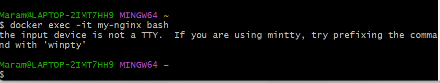

# Virtual Machines (VMs) vs Containers

## Virtual Machines (VMs)
- Abstraction of a physical server, turning one server into many.
- A **hypervisor** is installed on the host server, allowing multiple VMs to run on a single machine.
- Each VM includes a **full copy of an operating system (OS)**.
- **Resource-intensive** due to OS duplication.

## Containers
- Abstraction at the application layer, packaging application artifacts and dependencies together.
- Containers **share the host OS**, unlike VMs that require separate OS instances.
- Each container runs in its **own isolated process**, controlled by the **Docker Engine**.
- **Lightweight** compared to VMs, with minimal overhead.


## Benefits of Virtual Machines (VMs) Over Traditional Architecture
- **Better Hardware Utilisation** – Run multiple OS instances on a single physical machine.
- **Isolation** – Each VM is fully isolated, improving security and stability.
- **OS Flexibility** – Can run different OS versions/types on the same hardware.
- **Legacy Application Support** – Ideal for running older applications that require full OS environments.
- **Disaster Recovery & Snapshots** – VMs support easy backup, recovery, and migration.

## Benefits of Containers Over Virtual Machines
- **Lightweight** – No full OS duplication, reducing resource consumption.
- **Faster Deployment** – Boots up in seconds, unlike VMs which take minutes.
- **Scalability** – Easily spin up/down instances as needed for microservices.
- **Portability** – Runs the same across different environments (development, testing, production).
- **Efficient Resource Usage** – Shares the same OS kernel, reducing overhead.

# Microservices Architecture

## Overview
- Microservices architecture is an approach to system design that **breaks complex systems into smaller, manageable services**.
- Each microservice is **independently deployable** and communicates via **APIs**.
- This architecture enables **scalability, flexibility, and easier maintenance**.

---
## How Microservices Are Made Possible

- **Containers** – Tools like Docker and Kubernetes package and run microservices efficiently.
- **APIs** – Microservices communicate using REST, gRPC, or GraphQL.
- **Service Discovery** – Kubernetes and AWS Service Discovery help services find each other.
- **CI/CD Pipelines** – Automates building, testing, and deploying services.
- **Messaging Queues** – Kafka and RabbitMQ enable async communication between services.
- **Cloud Platforms** – AWS, Azure, and Google Cloud provide scalable infrastructure.
- **Monitoring Tools** – Prometheus and Grafana track service health and performance.

## Advantages of Microservices Architecture

### 1. **Accelerate Scalability**
- Each microservice runs independently, making it easier to **add, remove, update, or scale** services without affecting others.
- Resources can be allocated dynamically based on **demand spikes** (e.g., seasonal shopping periods).

### 2. **Improved Fault Isolation**
- Unlike monolithic systems, failure in one service **does not bring down the entire application**.
- Fault-tolerant strategies prevent cascading failures.

### 3. **Programming Language and Technology Agnostic**
- Developers can use **different languages and frameworks** for different microservices.
- No need to learn a new language to work on a specific service.
- Supports **cloud-based deployment**, allowing access from any internet-connected device.

### 4. **Simpler Deployment**
- Teams can deploy independent services without affecting others.
- New features or updates can be added **without redesigning the entire system**.

### 5. **Reusability Across Business Areas**
- Common microservices (e.g., login, payment processing) can be shared across multiple applications.

### 6. **Faster Time-to-Market**
- Independent development of microservices means teams **don’t have to wait** for other services to be completed.
- Enables rapid **feature deployment** without major system disruptions.

### 7. **Ability to Experiment**
- New features can be tested and rolled back quickly if they don’t meet expectations.
- Reduces the risk of introducing large-scale failures.

# Docker 

## What is Docker?
- Docker is an **open platform for developing, shipping, and running applications** in containers.
- It allows developers to separate applications from infrastructure, enabling **faster software delivery**.
- Containers run the same regardless of the underlying environment, ensuring **portability and consistency**.
- Docker provides tooling and a universal packaging format, making application deployment **more efficient and scalable**.

---

## Alternatives to Docker
- **Podman** – A daemonless container engine with a focus on security.
- **LXC (Linux Containers)** – A lightweight virtualization method for running multiple isolated Linux systems.
- **containerd** – An industry-standard container runtime used by Kubernetes.
- **CRI-O** – A Kubernetes-focused container runtime that follows the OCI standard.
- **rkt (Rocket)** – A security-focused container runtime (now discontinued).

---

## How Docker Works (Docker Architecture/API)
- **Docker Client** – CLI or API that allows users to interact with the Docker daemon.
- **Docker Daemon** – Runs in the background and manages images, containers, and networks.
- **Docker Images** – Read-only templates containing an application and its dependencies.
- **Docker Containers** – Instances of images that run applications in isolated environments.
- **Docker Registry** – Stores and distributes images (e.g., Docker Hub, private registries).
- **Docker Compose** – A tool for defining and running multi-container applications using YAML files.

---

## Success Story Using Docker
### **Spotify**
- Spotify leverages Docker to **build, test, and deploy** services efficiently.
- Docker helps **scale microservices** across multiple environments while ensuring consistency.
- Using Docker containers, Spotify **reduces infrastructure overhead** and speeds up software delivery.


# Task 1 : Run and Pull Your First Docker Image

## 1. Open Git Bash
Ensure Docker is running in the background before proceeding. Run:
```sh
docker login
```

---

## 2. Get Help from the Docker Command
Run:
```sh
docker --help
```
This shows a list of available Docker commands. You can also get help for specific commands, e.g.:
```sh
docker run --help
```

---

## 3. Show All Docker Images on Your Machine
Run:
```sh
docker images
```
or
```sh
docker image ls
```
If this is your first time using Docker, the list will likely be empty.

---

## 4. Run Your First Docker Container (`hello-world` Image)
Run:
```sh
docker run hello-world
```
This does the following:
1. Docker checks if the `hello-world` image exists locally.
2. If not, it pulls the image from Docker Hub.
3. It creates and runs a container from this image.
4. It outputs a welcome message explaining what happened.

---

## 5. Run the Same Command Again
Run:
```sh
docker run hello-world
```
- This time, Docker does not download the image again because it already exists locally.
- Instead, it reuses the existing image and creates a new container.

  


- You can confirm this by listing all existing images:
  ```sh
  docker images
  ```
- To list all previous containers (including stopped ones), use:
  ```sh
  docker ps -a
  ```

---

## Task 2 :Running an Nginx Web Server in Docker

### 1. Open Git Bash 
Ensure Docker is running in the background.

### 2. Download the Latest Nginx Docker Image
Run:
```sh
docker pull nginx
```
This downloads the latest Nginx image from Docker Hub.

### 3. Run the Nginx Container and Expose Port 80
Run:
```sh
docker run -d -p 80:80 --name my-nginx nginx
```
Explanation:
- `-d` runs the container in detached mode (background).
- `-p 80:80` maps port 80 of the container to port 80 on your machine.
- `--name my-nginx` assigns a name to the container.
- `nginx` specifies the image to use.

### 4. Check if the Nginx Container is Running
Run:
```sh
docker ps
```
This lists running containers. If you see `my-nginx`, the server is running.


### 5. Open Nginx in Your Browser
- Open `http://localhost` or `http://127.0.0.1` in your web browser.
- You should see the Nginx welcome page.


### 6. Stop the Running Container
To stop the `my-nginx` container, run:
```sh
docker stop my-nginx
```
If you also want to remove the container, run:
```sh
docker rm my-nginx
```

---

# Task 3: Removing a Running Docker Container

### 1. Check If Nginx Is Running
Run:
```sh
docker ps
```
You should see `my-nginx` in the list.

### 2. Attempt to Remove the Running Container
Run:
```sh
docker rm my-nginx
```
**Expected Error:**
```
Error response from daemon: You cannot remove a running container my-nginx. Stop the container before attempting removal or use -f.
```
Docker prevents you from removing an active container.


### 3. Force-Remove the Running Container
To stop and remove the container in one step, use:
```sh
docker rm -f my-nginx
```
This forces the container to stop and deletes it immediately.


### 4. Verify That the Container Is Gone
Run:
```sh
docker ps -a
```
 `my-nginx` no longer appears, the removal was successful.


# Task 4: Modifying a Running Nginx Container

### 1. Run the Nginx Container on Port 80
```sh
docker run -d -p 80:80 --name my-nginx nginx
```
Verify it's running:
```sh
docker ps
```

### 2. Check the Default Webpage
- Open `http://localhost` or `http://127.0.0.1` in a browser.
- You should see the default Nginx welcome page.

### 3. Access the Nginx Container Shell
Run:
```sh
docker exec -it my-nginx bash
```



If using Git Bash and you get a TTY error, use:
```sh
winpty docker exec -it my-nginx bash
```
#### **Temporary Alias (For Current Session)**
Run the following command to create a temporary alias:
```sh
alias docker='winpty docker'
```

### 4. Update & Upgrade Packages
Inside the container, run:
```sh
apt update && apt upgrade -y
```

### 5. Fix `sudo` Not Found Issue
Run:
```sh
sudo ls
```
Expected error:
```
bash: sudo: command not found
```
Fix it by installing `sudo`:
```sh
apt install sudo -y
```

### 6. Navigate to the Default Nginx Web Page Directory
Find your current working directory:
```sh
pwd
```
Move to the Nginx root directory:
```sh
cd /usr/share/nginx/html
```
List the files:
```sh
ls -l
```
You should see `index.html`.

### 7. Edit `index.html` Using `nano`
Try opening the file:
```sh
nano index.html
```
If `nano` is missing, install it:
```sh
apt install nano -y
```
Modify the file:
- Change **"Welcome to nginx!"** to **"Welcome to the Tech501 Dreamteam!"**.
- Save changes: `CTRL + X`, then `Y`, then `Enter`.

### 8. Verify the Changes
Exit the container:
```sh
exit
```
Refresh `http://localhost` in the browser. The modified message should be visible.


# Task 5: Running Another Container on Port 80 and Resolving Port Conflict

### 1. Ensure Your Modified Nginx Container Is Running
Run:
```sh
docker ps
```
You should see `my-nginx` running on port 80.
If it's not running, restart it:
```sh
docker run -d -p 80:80 --name my-nginx nginx
```

### 2. Try to Run Another Container on Port 80
Run:
```sh
docker run -d -p 80:80 --name dreamteam-nginx daraymonsta/nginx-257:dreamteam
```

### 3. Document the Error
**Expected Error:**
```
docker: Error response from daemon: driver failed programming external connectivity on endpoint dreamteam-nginx
Bind for 0.0.0.0:80 failed: port is already allocated.
```
This happens because port 80 is already in use by `my-nginx`, and Docker cannot bind two containers to the same host port.


### 4. Remove the Failed Container
Check if the failed container exists:
```sh
docker ps -a
```
If you see `dreamteam-nginx` in the list (but stopped), remove it:
```sh
docker rm dreamteam-nginx
```

### 5. Run the Container on Port 90
Since port 80 is occupied, we’ll use port 90 instead:
```sh
docker run -d -p 90:80 --name dreamteam-nginx daraymonsta/nginx-257:dreamteam
```
Check that it's running:
```sh
docker ps
```


You should see `dreamteam-nginx` now mapped to port 90.

### 6. Verify in Your Browser
- Open `http://localhost:90` or `http://127.0.0.1:90` in your browser.
- You should see the webpage for the new container.


# Task 6: Creating and Pushing a Custom Nginx Image to Docker Hub

### 1. Commit the Running Nginx Container into an Image
Since  `my-nginx` container already has a **modified `index.html`**, we will create an image from it.

Run:
```sh
docker commit my-nginx mrmri9/custom-nginx:v1
```
- `my-nginx` → The **running container**.
- `mrmri9/custom-nginx:v1` → The **new image** (`v1` is the tag).  
  *Replace `mrmri9` with your **Docker Hub username**.*

Verify the new image exists:
```sh
docker images
```
You should see `mrmri9/custom-nginx:v1` in the list.

---

### 2. Push the Image to Docker Hub
1. **Log in to Docker Hub** :
   ```sh
   docker login
   ```
2. **Push the image to your Docker Hub repository:**
   ```sh
   docker push mrmri9/custom-nginx:v1
   ```

---

### 3. Run a Container Using the Pushed Image
Now, we run a new container from **your Docker Hub image**:
```sh
docker run -d -p 8080:80 --name my-custom-nginx mrmri9/custom-nginx:v1
```
- `-d` → Runs in detached mode.
- `-p 8080:80` → Maps **port 8080** on the host to **port 80** inside the container.
- `--name my-custom-nginx` → Names the container.
- `mrmri9/custom-nginx:v1` → Pulls the image from your **Docker Hub repository**.

Check that it’s running:
```sh
docker ps
```


---

### 4. Verify in Browser
- Open `http://localhost:8080` in the browser.
- we should see the **modified Nginx homepage**.


# Task 7: Automating Docker Image Creation Using a Dockerfile

## 1. Create a New Directory
Since we want to automate the process, we will create a new directory for the project.
```sh
mkdir tech501-mod-nginx-dockerfile
cd tech501-mod-nginx-dockerfile
```

---

## 2. Create a Custom `index.html`
Inside the folder, create a new `index.html` file:
```sh
touch index.html
```
Edit the file and add:
```html
<!DOCTYPE html>
<html>
<head>
    <title>Welcome</title>
</head>
<body>
    <h1>Welcome to the Tech 501 Dreamteam!</h1>
</body>
</html>
```
This custom page will replace the default Nginx page.

---

## 3. Create a `Dockerfile`
Now, create a `Dockerfile` inside the folder:
```sh
touch Dockerfile
```
Edit the `Dockerfile` and add:
```dockerfile
# Use the official nginx base image
FROM nginx:latest

# Copy the custom index.html to the nginx web directory
COPY index.html /usr/share/nginx/html/index.html

# Expose port 80
EXPOSE 80

# Start Nginx
CMD ["nginx", "-g", "daemon off;"]
```
This Dockerfile:
- Uses **Nginx as a base image**.
- Copies `index.html` into the Nginx web directory.
- Exposes **port 80**.
- Starts **Nginx as a foreground process**.

---

## 4. Build the Custom Docker Image
Run:
```sh
docker build -t tech501-nginx-auto:v1 .
```
- `-t tech501-nginx-auto:v1` → Tags the image as `v1`.
- `.` → Uses the **current directory** as the build context.

Verify the image exists:
```sh
docker images
```

---

## 5. Run the Custom Image Locally
Start the container using:
```sh
docker run -d -p 8080:80 --name auto-nginx tech501-nginx-auto:v1
```
- This runs the custom **Nginx container**.
- Open **http://localhost:8080** in your browser to see the page.

---

## 6. Push the Image to Docker Hub
### 1. Log in to Docker Hub:
```sh
docker login
```
### 2. Tag the image with your own Docker Hub username:
```sh
docker tag tech501-nginx-auto:v1 mrmri9/nginx-auto:v1
```
### 3. Push the image to Docker Hub:
```sh
docker push mrmri9/nginx-auto:v1
```
Now, the image is **publicly available** on Docker Hub.

---

## 7. Remove the Local Copy of the Image
To simulate a fresh pull from Docker Hub:
```sh
docker rmi tech501-nginx-auto:v1
```
Verify it's removed:
```sh
docker images
```

---

## 8. Force Docker to Pull the Image from Docker Hub
Since the local copy is gone, Docker **must** pull it from **Docker Hub**.
```sh
docker run -d -p 9191:80 --name fresh-nginx mrmri9/nginx-auto:v1
```
Check that it's running:
```sh
docker ps
```

---

## 9. Verify in Browser
- Open **http://localhost:9191**.
- You should see your **custom Nginx page**.


# Task 8: Running the Node.js v20 Sparta Test App in a Docker Container

## 1. Create a New Project Folder
Each Docker project needs its own `Dockerfile`, so we create a separate directory:
```sh
mkdir sparta-node-docker
cd sparta-node-docker
```

---

## 2. Copy the `app` Folder Inside the New Directory
Since we want to keep the original `app` folder, we copy it instead of moving:
```sh
cp -r ~/path/to/app ./app
```
Verify that the `app` folder exists:
```sh
ls -l
```

## 3. Create the `Dockerfile`
Inside `sparta-node-docker`, create a `Dockerfile`:
```sh
touch Dockerfile
```
Edit the `Dockerfile` and add:
```dockerfile
# Use Node.js v20 as the base image
FROM node:20

# Set the working directory inside the container
WORKDIR /usr/src/app

# Copy the application code into the container
COPY app /usr/src/app

# Copy package.json and install dependencies
COPY app/package*.json ./
RUN npm install

# Expose port 3000
EXPOSE 3000

# Start the application
CMD ["node", "app.js"]
```

---

## 4. Build the Docker Image
Run:
```sh
docker build -t sparta-node:v1 .
```
Verify the image was created:
```sh
docker images
```

---

## 5. Run the Container Locally
Start the container and map it to port 3000:
```sh
docker run -d -p 3000:3000 --name sparta-node sparta-node:v1
```
Verify the container is running:
```sh
docker ps
```
Open **http://localhost:3000** in your browser to confirm it works.


---

## 6. Push the Image to Docker Hub
1. **Log in to Docker Hub**:
   ```sh
   docker login
   ```
2. **Tag the image**:
   ```sh
   docker tag sparta-node:v1 mrmri9/sparta-node:v1
   ```
3. **Push the image**:
   ```sh
   docker push mrmri9/sparta-node:v1
   ```

---

## 7. Remove the Local Copy of the Image
To simulate pulling from Docker Hub, remove the local image:
```sh
docker rmi sparta-node:v1
```
Verify it's removed:
```sh
docker images
```

---

## 8. Run the Container from Docker Hub
Now, pull and run the image from **Docker Hub**:
```sh
docker run -d -p 3000:3000 --name fresh-sparta-node mrmri9/sparta-node:v1
```


# Task 9: Docker Compose

## **Why Use Docker Compose?**
Docker Compose is a **tool** used to **define and manage multi-container Docker applications** using a simple **YAML file**.

### ** Benefits:**
- **Easier Multi-Container Management** → Instead of running multiple `docker run` commands, you define everything in `docker-compose.yml`.
- **Simplifies Networking** → Containers can easily communicate using service names instead of IP addresses.
- **Environment Management** → Supports `.env` files for configuration.
- **Scalability** → You can scale services (`docker-compose up --scale`).
- **Portable & Reproducible** → One `docker-compose.yml` can deploy the same setup on any machine.

---

## **How to Use Docker Compose?**
### **Installation Requirements:**
- **Docker must be installed.**
- **Docker Compose is built-in** with **Docker Desktop**.

### **Storing the Docker Compose File**
- The `docker-compose.yml` file should be in the **project root directory**.
- It defines services, networks, and volumes.

Example directory structure:
```plaintext
sparta-node-docker/
│── app/
│── Dockerfile
│── docker-compose.yml  # This is where the configuration is stored
```

---

## **Important Docker Compose Commands**  

| **Command** | **Explanation** |
|------------|---------------|
| `docker-compose up` | Starts the application. |
| `docker-compose up -d` | Starts in **detached mode** (runs in background). |
| `docker-compose down` | Stops and removes all containers. |
| `docker-compose ps` | Lists running services. |
| `docker-compose logs -f` | Shows real-time logs. |
| `docker-compose images` | Lists images used by the project. |
| `docker-compose restart` | Restarts all services. |

---

## ** Running the Application with Docker Compose**
### **Start Without Detached Mode**
```sh
docker-compose up
```
- Runs services in the foreground.
- Logs are visible in real-time.
- Press `CTRL+C` to stop.

### **Start in Detached Mode**
```sh
docker-compose up -d
```
- Runs in the **background**.
- Does **not** show logs in the terminal.
- Logs can still be viewed using:
  ```sh
  docker-compose logs -f
  ```

### ** Difference Between Running With & Without Detached Mode**

| Mode | Behavior |
|------|----------|
| **Without `-d`** | Logs appear in the terminal, stops when you close it. |
| **With `-d`** | Runs in the background, use `docker-compose logs -f` to view logs. |


# Task 10: Running Node.js App & MongoDB with Docker Compose

## **1-Setting Up Docker Compose for Node.js & MongoDB**

We used **Docker Compose** to manage a **Node.js app** and a **MongoDB database** together in a multi-container setup.

### **Docker Compose Configuration**
Inside the project directory (`sparta-node-docker`), we created a `docker-compose.yml` file:

```yaml
version: "3"

services:
  app:
    image: mrmri9/sparta-node:v1
    container_name: sparta-node
    ports:
      - "3000:3000"
    depends_on:
      - mongo
    environment:
      DB_HOST: mongodb://mongo:27017/sparta_db
    command: sh -c "node seeds/seed.js && npm start"

  mongo:
    image: mongo:latest
    container_name: mongodb
    ports:
      - "27017:27017"
    volumes:
      - mongo-data:/data/db
    command: mongod --bind_ip 0.0.0.0

volumes:
  mongo-data:
```

---

## **2️- Running the Application**
To start the containers, we ran:
```sh
docker-compose up -d
```
This created and launched both **MongoDB** and the **Node.js app**.

To check if the containers were running:
```sh
docker-compose ps
```

---

## **3️- Seeding the Database**
We used a **seed script** (`seeds/seed.js`) to populate MongoDB with test data.

### **Running the Seeding Script**
Inside the **sparta-node** container:
```sh
winpty docker exec -it sparta-node bash
```
Then:
```sh
export DB_HOST="mongodb://mongo:27017/sparta_db"
node seeds/seed.js
```
**Expected Output:**
```plaintext
Connected to database
Database cleared
Database seeded with 100 records
Database connection closed
```

To verify the data inside MongoDB:
```sh
docker exec -it mongodb bash
mongosh
use sparta_db
db.posts.find().pretty()
```

---

## **4️- Fixing Issues & Blockers**

### **Blocker 1: `Cannot GET /posts` Error**
**Issue:** The `/posts` route did not work.

**Fix:**
- Checked `app.js` and found that `/posts` was inside an `if(process.env.DB_HOST)` block.
- `DB_HOST` was missing, so we updated `docker-compose.yml` to include:
  ```yaml
  environment:
    DB_HOST: mongodb://mongo:27017/sparta_db
  ```
- Restarted everything:
  ```sh
  docker-compose down
  docker-compose up -d
  ```
- `/posts` worked after the fix!

### **Blocker 2: MongoDB Connection Issues**
**Issue:** `DB_HOST` was not set inside the container, preventing MongoDB from connecting.

**Fix:**
- Manually set `DB_HOST` in the container:
  ```sh
  export DB_HOST="mongodb://mongo:27017/sparta_db"
  ```
- Updated `docker-compose.yml` to set `DB_HOST` automatically.

### **Blocker 3: "the input device is not a TTY" Error in Git Bash**
**Issue:** Running `docker exec -it` inside Git Bash gave an error.

**Fix:** Used `winpty` before the command:
```sh
winpty docker exec -it sparta-node bash
```

---

## **4- Final Testing**
After resolving all issues, we successfully accessed **`/posts`** in the browser:
```plaintext
http://localhost:3000/posts
```


Also tested with **cURL**:
```sh
curl -X GET http://localhost:3000/posts
```

# Running Docker Containers on EC2 with Nginx Reverse Proxy (Ubuntu)

## 1. **Connect to Your EC2 Instance**
SSH into your EC2 instance using the following command:
```bash
ssh -i ~/path/to/private/key ubuntu@<EC2-IP>
```

## 2. **Install Docker & Docker Compose**
Update the system and install Docker:
```bash
sudo apt update -y
sudo apt install docker.io -y
sudo systemctl start docker
sudo systemctl enable docker
sudo usermod -aG docker ubuntu
```

Log out and log back in to apply Docker permissions:
```bash
exit
ssh -i ~/path/to/private/key ubuntu@<EC2-IP>
```

Verify Docker installation:
```bash
docker --version
docker ps
```

Install Docker Compose:
```bash
sudo curl -L "https://github.com/docker/compose/releases/latest/download/docker-compose-$(uname -s)-$(uname -m)" -o /usr/local/bin/docker-compose
sudo chmod +x /usr/local/bin/docker-compose
docker-compose --version
```

## 3. **Clone Your GitHub Repository**
Clone your repository to your EC2 instance:
```bash
git clone https://github.com/marmari9/sparta-docker-deployment.git
cd sparta-docker-deployment/sparta-node-docker
```

## 4. **Run Docker Compose**
Pull the latest images:
```bash
docker-compose pull
```

Start the containers:
```bash
docker-compose up -d
```

## 5. **Check If Everything is Running**
List running containers:
```bash
docker ps
```

Test the app from the EC2 instance:
```bash
curl -X GET http://localhost:3000/posts
```

Test from your browser:
```
Open http://<EC2-IP>:3000/posts
```

## 6. **Expose the App Properly**
If the browser test doesn't work, check EC2 security groups:
- Allow Inbound Rule for Port 3000 (Custom TCP Rule, Anywhere).

## 7. **Set Up Nginx Reverse Proxy (Port 8080)**
Install Nginx:
```bash
sudo apt update
sudo apt install nginx -y
```

Configure Nginx as a reverse proxy:
```bash
sudo nano /etc/nginx/sites-available/default
```

Replace the contents with:
```nginx
server {
    listen 8080;
    server_name localhost;

    location / {
        proxy_pass http://localhost:3000;
        
    }
}
```

Save and exit (CTRL+X → Y → Enter).

Restart Nginx:
```bash
sudo systemctl restart nginx
```

Check if Nginx is listening on port 8080:
```bash
ss -tulnp | grep 8080
```

Test in the browser:
```
Open http://<EC2-IP>:8080/posts
```

## 8. **Security Group Configuration**
Ensure EC2 security group allows inbound traffic on port 8080:
- Go to AWS Console → EC2 → Security Groups.
- Edit Inbound Rules → Add Rule: Custom TCP, Port 8080, Source: Anywhere (0.0.0.0/0).

## 9. **Verify the Database and App**
SSH into your EC2 instance and enter the Node.js container:
```bash
docker exec -it sparta-node bash
```

Set the environment variable and seed the database:
```bash
export DB_HOST="mongodb://mongo:27017/sparta_db"
node seeds/seed.js
```

Verify data in MongoDB:
```bash
docker exec -it mongodb bash
mongosh
use sparta_db
db.posts.find().pretty()
```

Exit the containers:
```bash
exit
exit
```

Test the API again:
```
Open http://<EC2-IP>:3000/posts
```


