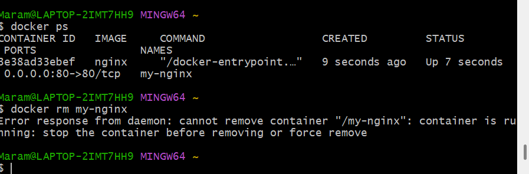

# Task: Run and Pull Your First Docker Image

## 1. Open Git Bash (or Terminal on Mac)
Ensure Docker is running in the background before proceeding.

---

## 2. Get Help from the Docker Command
Run:
```sh
docker --help
```
This shows a list of available Docker commands. You can also get help for specific commands, e.g.:
```sh
docker run --help
```

---

## 3. Show All Docker Images on Your Machine
Run:
```sh
docker images
```
or
```sh
docker image ls
```
If this is your first time using Docker, the list will likely be empty.

---

## 4. Run Your First Docker Container (`hello-world` Image)
Run:
```sh
docker run hello-world
```
This does the following:
1. Docker checks if the `hello-world` image exists locally.
2. If not, it pulls the image from Docker Hub.
3. It creates and runs a container from this image.
4. It outputs a welcome message explaining what happened.

---

## 5. Run the Same Command Again
Run:
```sh
docker run hello-world
```
- This time, Docker does not download the image again because it already exists locally.
- Instead, it reuses the existing image and creates a new container.
- You can confirm this by listing all existing images:
  ```sh
  docker images
  ```
- To list all previous containers (including stopped ones), use:
  ```sh
  docker ps -a
  ```

---


---

## 7. Running an Nginx Web Server in Docker

### 1. Open Git Bash (or Terminal on Mac)
Ensure Docker is running in the background.

### 2. Download the Latest Nginx Docker Image
Run:
```sh
docker pull nginx
```
This downloads the latest Nginx image from Docker Hub.

### 3. Run the Nginx Container and Expose Port 80
Run:
```sh
docker run -d -p 80:80 --name my-nginx nginx
```
Explanation:
- `-d` runs the container in detached mode (background).
- `-p 80:80` maps port 80 of the container to port 80 on your machine.
- `--name my-nginx` assigns a name to the container.
- `nginx` specifies the image to use.

### 4. Check if the Nginx Container is Running
Run:
```sh
docker ps
```
This lists running containers. If you see `my-nginx`, the server is running.


### 5. Open Nginx in Your Browser
- Open `http://localhost` or `http://127.0.0.1` in your web browser.
- You should see the Nginx welcome page.


### 6. Stop the Running Container
To stop the `my-nginx` container, run:
```sh
docker stop my-nginx
```
If you also want to remove the container, run:
```sh
docker rm my-nginx
```

---

## 8. Removing a Running Docker Container

### 1. Check If Nginx Is Running
Run:
```sh
docker ps
```
You should see `my-nginx` in the list.

### 2. Attempt to Remove the Running Container
Run:
```sh
docker rm my-nginx
```
**Expected Error:**
```
Error response from daemon: You cannot remove a running container my-nginx. Stop the container before attempting removal or use -f.
```
Docker prevents you from removing an active container.





### 3. Force-Remove the Running Container
To stop and remove the container in one step, use:
```sh
docker rm -f my-nginx
```
This forces the container to stop and deletes it immediately.


### 4. Verify That the Container Is Gone
Run:
```sh
docker ps -a
```
If `my-nginx` no longer appears, the removal was successful.


# 6. Modifying a Running Nginx Container

### 1. Run the Nginx Container on Port 80
```sh
docker run -d -p 80:80 --name my-nginx nginx
```
- `-d` runs it in the background.
- `-p 80:80` maps the container's port 80 to the host's port 80.
- `--name my-nginx` assigns the name `my-nginx`.

Verify it's running:
```sh
docker ps
```

### 2. Check the Default Webpage
- Open `http://localhost` or `http://127.0.0.1` in a browser.
- You should see the default Nginx welcome page.

### 3. Access the Nginx Container Shell
Run:
```sh
docker exec -it my-nginx bash
```


If using Git Bash and you get a TTY error, use:
```sh
winpty docker exec -it my-nginx bash
```

### 4. Update & Upgrade Packages
Inside the container, run:
```sh
apt update && apt upgrade -y
```

### 5. Fix `sudo` Not Found Issue
Run:
```sh
sudo ls
```
Expected error:
```
bash: sudo: command not found
```
Fix it by installing `sudo`:
```sh
apt install sudo -y
```

### 6. Navigate to the Default Nginx Web Page Directory
Find your current working directory:
```sh
pwd
```
Move to the Nginx root directory:
```sh
cd /usr/share/nginx/html
```
List the files:
```sh
ls -l
```
You should see `index.html`.

### 7. Edit `index.html` Using `nano`
Try opening the file:
```sh
nano index.html
```
If `nano` is missing, install it:
```sh
apt install nano -y
```
Modify the file:
- Change **"Welcome to nginx!"** to **"Welcome to the Tech501 Dreamteam!"**.
- Save changes: `CTRL + X`, then `Y`, then `Enter`.

### 8. Verify the Changes
Exit the container:
```sh
exit
```
Refresh `http://localhost` in the browser. The modified message should be visible.


## 6. Running Another Container on Port 80 and Resolving Port Conflict

### 1. Ensure Your Modified Nginx Container Is Running
Run:
```sh
docker ps
```
You should see `my-nginx` running on port 80.
If it's not running, restart it:
```sh
docker run -d -p 80:80 --name my-nginx nginx
```

### 2. Try to Run Another Container on Port 80
Run:
```sh
docker run -d -p 80:80 --name dreamteam-nginx daraymonsta/nginx-257:dreamteam
```

### 3. Document the Error
**Expected Error:**
```
docker: Error response from daemon: driver failed programming external connectivity on endpoint dreamteam-nginx
Bind for 0.0.0.0:80 failed: port is already allocated.
```
This happens because port 80 is already in use by `my-nginx`, and Docker cannot bind two containers to the same host port.


### 4. Remove the Failed Container
Check if the failed container exists:
```sh
docker ps -a
```
If you see `dreamteam-nginx` in the list (but stopped), remove it:
```sh
docker rm dreamteam-nginx
```

### 5. Run the Container on Port 90
Since port 80 is occupied, we’ll use port 90 instead:
```sh
docker run -d -p 90:80 --name dreamteam-nginx daraymonsta/nginx-257:dreamteam
```
Check that it's running:
```sh
docker ps
```


You should see `dreamteam-nginx` now mapped to port 90.

### 6. Verify in Your Browser
- Open `http://localhost:90` or `http://127.0.0.1:90` in your browser.
- You should see the webpage for the new container.


## 6. Creating and Pushing a Custom Nginx Image to Docker Hub

### 1. Commit the Running Nginx Container into an Image
Since your `my-nginx` container already has a **modified `index.html`**, we will create an image from it.

Run:
```sh
docker commit my-nginx mrmri9/custom-nginx:v1
```
- `my-nginx` → The **running container**.
- `mrmri9/custom-nginx:v1` → The **new image** (`v1` is the tag).  
  *Replace `mrmri9` with your **Docker Hub username**.*

Verify the new image exists:
```sh
docker images
```
You should see `mrmri9/custom-nginx:v1` in the list.

---

### 2. Push the Image to Docker Hub
1. **Log in to Docker Hub** (if not logged in already):
   ```sh
   docker login
   ```
2. **Push the image to your Docker Hub repository:**
   ```sh
   docker push mrmri9/custom-nginx:v1
   ```

---

### 3. Run a Container Using the Pushed Image
Now, run a new container from **your Docker Hub image**:
```sh
docker run -d -p 8080:80 --name my-custom-nginx mrmri9/custom-nginx:v1
```
- `-d` → Runs in detached mode.
- `-p 8080:80` → Maps **port 8080** on the host to **port 80** inside the container.
- `--name my-custom-nginx` → Names the container.
- `mrmri9/custom-nginx:v1` → Pulls the image from your **Docker Hub repository**.

Check that it’s running:
```sh
docker ps
```


---

### 4. Verify in Browser
- Open `http://localhost:8080` in your browser.
- You should see your **modified Nginx homepage**.


# Task: Automating Docker Image Creation Using a Dockerfile

## 1. Create a New Directory
Since we want to automate the process, we will create a new directory for the project.
```sh
mkdir tech501-mod-nginx-dockerfile
cd tech501-mod-nginx-dockerfile
```
This keeps the work **organized** and separate from existing projects.

---

## 2. Create a Custom `index.html`
Inside the folder, create a new `index.html` file:
```sh
touch index.html
```
Edit the file and add:
```html
<!DOCTYPE html>
<html>
<head>
    <title>Welcome</title>
</head>
<body>
    <h1>Welcome to the Tech 501 Dreamteam!</h1>
</body>
</html>
```
This custom page will replace the default Nginx page.

---

## 3. Create a `Dockerfile`
Now, create a `Dockerfile` inside the folder:
```sh
touch Dockerfile
```
Edit the `Dockerfile` and add:
```dockerfile
# Use the official nginx base image
FROM nginx:latest

# Copy the custom index.html to the nginx web directory
COPY index.html /usr/share/nginx/html/index.html

# Expose port 80
EXPOSE 80

# Start Nginx
CMD ["nginx", "-g", "daemon off;"]
```
This Dockerfile:
- Uses **Nginx as a base image**.
- Copies `index.html` into the Nginx web directory.
- Exposes **port 80**.
- Starts **Nginx as a foreground process**.

---

## 4. Build the Custom Docker Image
Run:
```sh
docker build -t tech501-nginx-auto:v1 .
```
- `-t tech501-nginx-auto:v1` → Tags the image as `v1`.
- `.` → Uses the **current directory** as the build context.

Verify the image exists:
```sh
docker images
```

---

## 5. Run the Custom Image Locally
Start the container using:
```sh
docker run -d -p 8080:80 --name auto-nginx tech501-nginx-auto:v1
```
- This runs the custom **Nginx container**.
- Open **http://localhost:8080** in your browser to see the page.

---

## 6. Push the Image to Docker Hub
### 1. Log in to Docker Hub:
```sh
docker login
```
### 2. Tag the image with your Docker Hub username:
```sh
docker tag tech501-nginx-auto:v1 mrmri9/nginx-auto:v1
```
### 3. Push the image to Docker Hub:
```sh
docker push mrmri9/nginx-auto:v1
```
Now, your image is **publicly available** on Docker Hub.

---

## 7. Remove the Local Copy of the Image
To simulate a fresh pull from Docker Hub:
```sh
docker rmi tech501-nginx-auto:v1
```
Verify it's removed:
```sh
docker images
```

---

## 8. Force Docker to Pull the Image from Docker Hub
Since the local copy is gone, Docker **must** pull it from **Docker Hub**.
```sh
docker run -d -p 9191:80 --name fresh-nginx mrmri9/nginx-auto:v1
```
Check that it's running:
```sh
docker ps
```

---

## 9. Verify in Browser
- Open **http://localhost:9191**.
- You should see your **custom Nginx page**.

